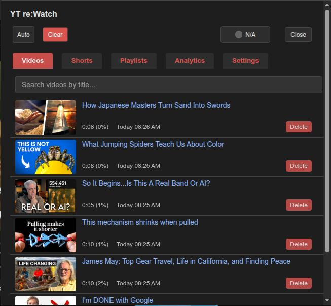
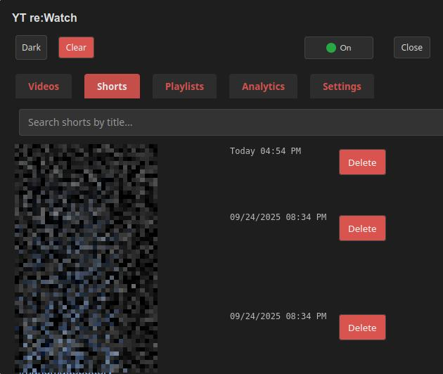
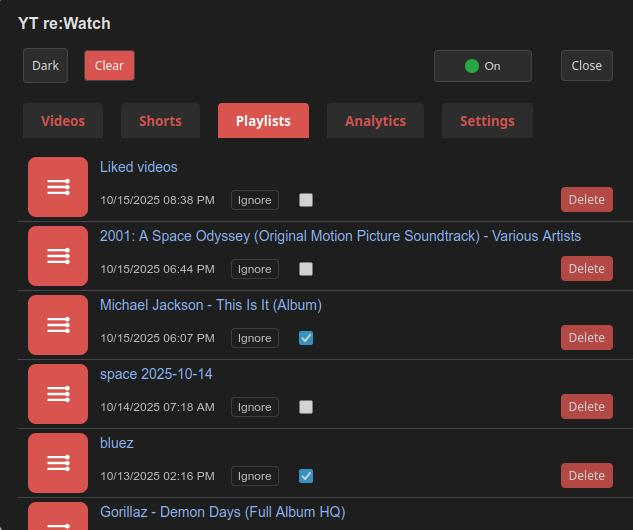
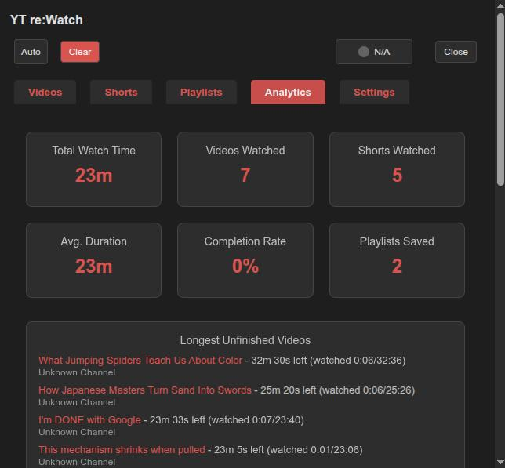
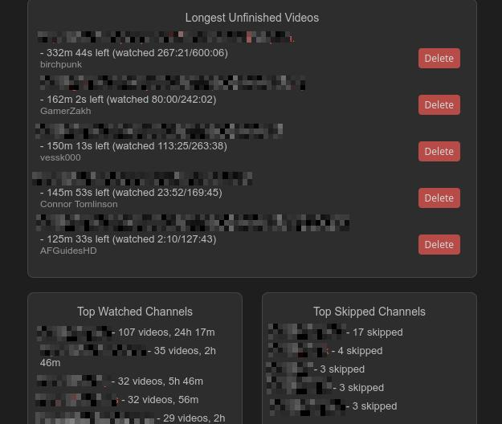
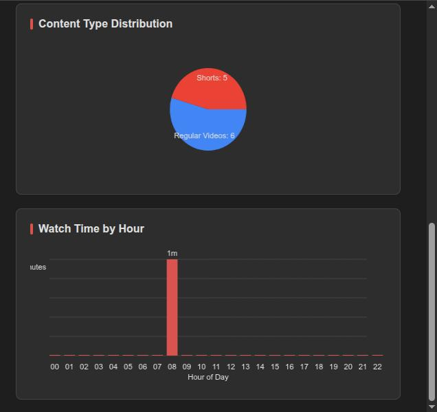
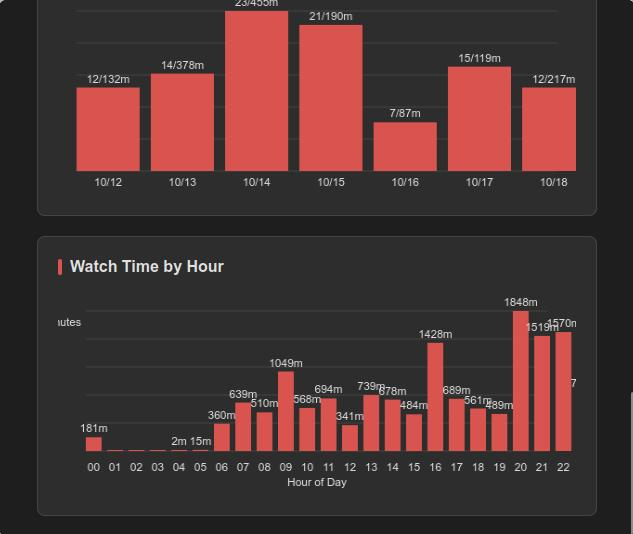
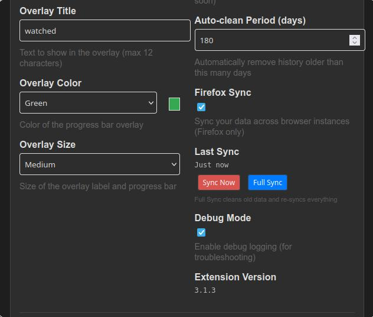
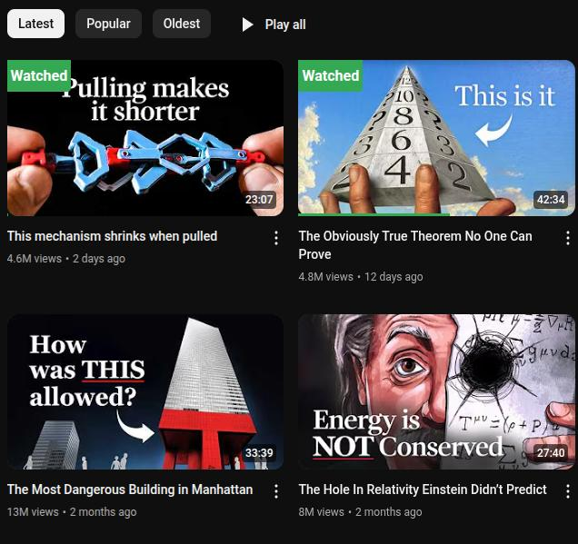

## ❤️ Support the Project

If you find YT re:Watch helpful, you can support ongoing development on [Patreon](https://patreon.com/EdinUser)!

# 📖 YT re:Watch YouTube History Extension Guide (Multi-Account & Privacy)

Your step-by-step guide to a privacy-first YouTube history extension that keeps progress consistent across multiple accounts (or no account), stores data locally, and helps you track and resume videos without Google access.

---

## 🚀 Quick Start (5 Minutes)

### Step 1: Install the Extension

**For Chrome Users:**
1. Visit the [Chrome Web Store page](https://chromewebstore.google.com/detail/local-youtube-video-histo/pebiokefjgdbfnkolmblaaladkmpilba)
2. Click "Add to Chrome" 
3. Click "Add Extension" when prompted
4. You'll see the YT re:Watch icon appear in your browser toolbar

**For Firefox Users:**
1. Visit the [Firefox Add-ons page](https://addons.mozilla.org/firefox/addon/yt-rewatch/)
2. Click "Add to Firefox"
3. Click "Add" when prompted
4. You'll see the YT re:Watch icon appear in your browser toolbar

### Step 2: Start Using YouTube Anonymously
1. Go to [youtube.com](https://youtube.com)
2. **No need to log in** - browse YouTube without an account
3. Start watching any video
4. Watch for at least 10 seconds
5. That's it! You're getting history tracking without Google surveillance

### 🔄 **Bonus: Account Independence**
**Here's the amazing part:** Your history works the same whether you:
- Use no YouTube account at all
- Switch between different YouTube accounts (work/personal)
- Log out and back in with different accounts
- Share the computer with family members

**Your viewing progress stays consistent across ALL situations!** 🎉

### ⚠️ **Privacy Reality Check**
**This extension only handles YouTube history data.** For broader privacy protection, you also need:
- **VPN** (hide your IP address)
- **Ad blocker** (block tracking scripts)
- **Privacy browser** (Firefox with strict settings, or Brave)

YT re:Watch stops YouTube from getting your viewing progress data, but Google still knows you visited their site.

### Step 3: View Your History
1. Click the YT re:Watch icon in your browser toolbar
2. You'll see your watched videos with progress indicators
3. Explore the different tabs to see all features

---

## 🎯 Understanding the Interface

### Extension Popup Overview
When you click the extension icon, you'll see 5 tabs:

| Tab | What It Shows |
|-----|---------------|
| **Videos** | Regular YouTube videos you've watched |
| **Shorts** | YouTube Shorts you've watched |
| **Playlists** | Playlists you've discovered |
| **Analytics** | Charts and statistics about your viewing |
| **Settings** | Customization options |

### What You See on YouTube
After watching videos, you'll notice:
- **"Viewed" label**: Small text overlay on video thumbnails
- **Progress bar**: Shows how much of the video you've watched
- **Percentage indicator**: Shows completion percentage (e.g., "75%")

### Videos Tab (Your Main History)

*The Videos tab shows your complete YouTube watch history, with progress, search, and delete options.*
  
Your history list shows the channel name under each video title to help you scan quickly.

### 🎬 Shorts Tab (YouTube Shorts)

*The Shorts tab tracks your YouTube Shorts viewing separately, helping you understand your short-form content habits.*
  
Shorts saves are now more reliable: the save cadence is 5 seconds and duration checks are relaxed to avoid missed saves.

### 📝 Playlists Tab

*The Playlists tab lists all playlists you've discovered, with quick access and management options.*

**Playlist Controls:**
- **Ignore videos (per‑playlist toggle):** When enabled for a specific playlist, YT re:Watch will not save watch progress for videos watched while viewing that playlist.
- **Works with global pause:** If either the global "Pause history in playlists" setting is enabled or a playlist's "Ignore" toggle is on, progress in that playlist won't be recorded.

### 📊 Analytics Tab (Statistics Dashboard)

**Overview Cards:**
- **Total Watch Time**: How much time you've spent watching videos
- **Videos Watched**: Number of regular videos
- **Shorts Watched**: Number of Shorts videos
- **Average Duration**: Average length of videos you watch
- **Completion Rate**: How often you finish videos (shown as %)
- **Playlists Saved**: Number of playlists you've discovered

**Analytics Cards:**
- **Longest Unfinished Videos**: Resume long videos you haven't finished (shows channel, time left, and link)
- **Top Watched Channels**: Your top 5 channels by videos watched (with links)
- **Top Skipped Channels**: Your top 5 channels where you most often skip long videos (with links)
- **Completion Bar Chart**: See your completion rate for long videos (skipped, partial, completed) with a bar chart and legend

**Other Interactive Charts:**
- **Weekly Activity Chart** (Bar Chart): Videos watched each day for the past 7 days
- **Watch Time by Hour** (Bar Chart): What time of day you watch the most content

**How to read the new completion bar chart:**
- Each bar shows the count of long videos that were skipped, partially watched, or completed
- The legend to the right shows the color, label, and percentage for each segment

*Summary cards and top channels in the Analytics tab.*

*Completion bar chart, unfinished videos, and skipped channels.*

*Watch activity by day and by hour in the Analytics tab.*

*Additional analytics showing watch time patterns and channel statistics*
  
These charts now prefer locally persisted, privacy‑preserving statistics for better accuracy and responsiveness. Keys are local‑day `YYYY-MM-DD` and 24 hourly buckets.

### ⚙️ Settings Tab (Customization)

**Theme Settings:**
- **Theme Preference**: Choose System, Light, or Dark
  - *System*: Follows your computer's theme
  - *Light*: Always use light theme
  - *Dark*: Always use dark theme
- **Quick toggle**: Click the theme button in the popup header to switch between light and dark modes instantly.

**Overlay Customization:**
- **Overlay Title**: Text shown on video thumbnails (max 12 characters)
  - Default: "viewed"
  - Examples: "seen", "watched", "✓", "done"
  - Changes apply immediately to all overlays
- **Overlay Color**: Color of the progress bar and overlay label
  - Options: Blue, Red, Green, Purple, Orange
  - See a live preview as you change colors
- **Overlay Label Size**: Size of the text and progress bar
  - Options: Small, Medium, Large, Extra Large
  - Affects both text size and progress bar thickness
  - Pick based on your screen size and preference

**Data Management:**
- **Auto-clean Period**: Automatically remove old history
  - Range: 1–180 days, or **Forever** to keep all history without age-based cleanup
  - Default: 90 days
  - Helps keep your history manageable while still allowing "forever history" if desired
- **Items per Page**: How many videos to show per page
  - Range: 5-20 items
  - Larger numbers = less scrolling, smaller numbers = faster loading
-- **Export History**: Back up your data to a file
-- **Import History**: Restore or merge data from a backup
-- **Robust Deletion System**: Deleted videos stay deleted with tombstone protection
  - Videos deleted from history use tombstone protection so they don't reappear from archives or imports
  - 30-day protection period ensures deletions persist across migrations and imports
  - Automatic cleanup of deletion markers after 30 days
 - **Persistent Statistics**: Analytics use a local stats snapshot (total, last 7 daily totals, 24 hourly totals). Seeded from your existing history after upgrade.

**Data Management:**
- **Export History**: Download complete history as JSON backup
- **Import History**: Restore data from backup files (Merge or Replace modes)
- **Migration Status**: Monitor hybrid storage migration progress
- **Cross-device usage**: There is **no automatic sync** – use Export/Import to move history between browsers or devices manually

**Advanced Settings:**
- **Debug Mode**: Enable detailed logging for troubleshooting
- **Version Info**: Shows current extension version

*Customize your experience in the Settings tab, including theme, overlays, and data management.*

*Additional settings for data management, privacy, and advanced features*

**Playlist Settings:**
- **Pause history in playlists (global):** When enabled, the extension does not save watch progress for videos played while you are browsing within any playlist. Use this if you generally don't want playlist sessions to affect your history.

### What You See on YouTube

*Visual overlays on YouTube show which videos you've watched and your progress at a glance.*

---

## 🔄 Data Management & Transfer

### Exporting Your History
1. **Open Settings**: Click the Settings tab in the extension popup
2. **Data Management**: Scroll to the "Data Management" section
3. **Export History**: Click the "Export History" button
4. **Download**: Your complete history will download as a JSON file
5. **Storage**: The file includes videos, playlists, and analytics data

### Importing History to Another Device
1. **Transfer File**: Move the exported JSON file to your other device
2. **Open Settings**: In the extension on the target device
3. **Import History**: Click "Import History" and select the JSON file
4. **Choose Mode**:
   - **Merge**: Combines with existing data (recommended)
   - **Replace**: Completely replaces existing history
5. **Confirm**: The import process will show progress and completion

### Understanding Hybrid Storage
- **IndexedDB**: Stores your complete history (unlimited capacity)
- **localStorage**: Keeps recent videos fast-accessible
- **Migration**: Automatic conversion from old storage systems
- **Performance**: Fast searches with indexed queries
- **Reliability**: Works even if IndexedDB is unavailable

---

## 🎨 Customization Guide

### Theme Customization

**Quick Theme Toggle:**
1. Click the theme button in the popup header
2. Toggles between light and dark themes
3. Bypasses system theme preference

**Detailed Theme Settings:**
1. Go to Settings tab
2. Choose "Theme Preference"
3. Select your preferred option:
   - **System**: Matches your OS theme automatically
   - **Light**: Always light theme
   - **Dark**: Always dark theme

### Overlay Customization

**Changing Overlay Text:**
1. Settings tab > "Overlay Title"
2. Enter your preferred text (max 12 characters)
3. Examples: "seen", "watched", "✓", "done"
4. Changes apply immediately

**Changing Colors:**
1. Settings tab > "Overlay Color"
2. Choose from: Blue, Red, Green, Purple, Orange
3. See live preview in the color box
4. Changes apply to all video thumbnails

**Adjusting Size:**
1. Settings tab > "Overlay Label Size"
2. Choose from: Small, Medium, Large, Extra Large
3. Affects both text size and progress bar thickness
4. Pick based on your screen size and preference

### Data Management

**Auto-cleanup Setup:**
1. Settings tab > "Auto-clean Period"
2. Choose how many days to keep history
3. Range: 1-180 days
4. Automatic cleanup runs daily

**Pagination Preferences:**
1. Settings tab > "Items per Page"
2. Choose how many videos to show per page
3. Range: 5-20 items
4. Larger numbers = less scrolling, smaller numbers = faster loading

---

## 📤 Backup & Export

### Exporting Your Data

**Why Export:**
- Backup before major browser updates
- Transfer data between browsers
- Keep a permanent record of your viewing history
- Analyze your data with external tools

**How to Export:**
1. Go to Settings tab
2. Click "Export History"
3. Choose a location to save the file
4. File will be named: `youtube-history-[date].json`

### Importing Data

**When to Import:**
- Restoring from a backup
- Transferring from another browser
- Merging data from multiple devices

**How to Import:**
1. Go to Settings tab
2. Click "Import History"
3. Select your backup file
4. Choose import mode:
   - **Merge**: Combines with existing data
   - **Replace**: Overwrites existing data
5. Import will begin automatically

### Understanding Export Format
The export file contains:
- **Metadata**: Export date, extension version, data counts
- **Video History**: All your watched videos with timestamps
- **Playlists**: All saved playlists
- **Settings**: Your customization preferences
- **Stats**: Aggregated watch‑time snapshot powering Analytics (from dataVersion 1.1) with last‑7‑days `daily` buckets and a 24‑slot `hourly` distribution to keep the snapshot compact.

---

## 🛠️ Troubleshooting

### Common Issues & Solutions

**Issue: Extension icon not visible**
- Check if extension is enabled in browser settings
- Look for the icon in the extension overflow menu
- Try restarting your browser

**Issue: Videos not being tracked**
- Make sure you're on youtube.com (not youtube.tv)
- Watch videos for at least 10 seconds
- Check if you're in incognito/private mode
- Disable other YouTube extensions temporarily

**Issue: History not showing**
- Close and reopen the extension popup
- Refresh the YouTube page
- Check if you're logged into the same browser profile
- Try exporting and importing your data

**Issue: Storage migration problems**
- Check Settings for migration progress status
- Ensure sufficient disk space for IndexedDB storage
- Restart browser if migration seems stuck
- Export data as backup before troubleshooting

### Performance Issues

**Slow Loading:**
- Reduce items per page in Settings
- Use search instead of browsing all history
- Consider using auto-cleanup for old entries

**Memory Usage:**
- The extension uses minimal memory
- Large histories (1000+ videos) may use more resources
- Regular cleanup helps maintain performance

### Getting Help

**Self-Service:**
1. Check this guide first
2. Review the [FAQ](./faq.md)
3. Try the troubleshooting steps above

**Community Support:**
- 💬 **[Join our Telegram community](https://t.me/+eFftKWGVvSpiZjZk)** - Active community support
- Ask questions and get help from other users
- Share tips and tricks with the community

**Bug Reports:**
- Visit our [GitHub Issues](https://github.com/EdinUser/YouTubeLocalHistory/issues)
- Search existing issues first
- Provide detailed information about your problem

---

## 🎯 Pro Tips & Best Practices

### Maximizing Your Experience

**Organization Tips:**
- Use meaningful overlay titles for easy identification
- Set up auto-cleanup to keep history manageable
- Export data regularly as backup
- Use search to quickly find specific videos

**Privacy Tips:**
- Enable auto-cleanup for sensitive viewing habits
- Export provides maximum privacy and control over your data
- Remember: all data stays on your device

**Productivity Tips:**
- Use Analytics tab to understand your viewing patterns
- Use export/import to transfer history between devices
- Use the completion rate to see which videos you actually finish

### Advanced Usage

**Data Analysis:**
- Export your data to analyze with spreadsheet software
- Track your video watching across educational content
- Monitor your entertainment vs educational content ratio

**Cross-Browser Usage:**
- Use export/import to transfer data between browsers
- Use export/import for manual data transfer between browsers
- Chrome users can use manual export/import

---

## 🎯 Multilanguage Support

YT re:Watch is available in English, German, Spanish, French, and Bulgarian. All non-English translations are currently machine-generated. If you notice any issues or want to help improve translations, see the technical documentation for how to contribute.

## 📞 Still Need Help?

**Quick Links:**
- 📖 [FAQ](./faq.md) - Common questions and answers
- 💬 [Telegram Community](https://t.me/+eFftKWGVvSpiZjZk) - Chat with other users
- 🐛 [Report Issues](https://github.com/EdinUser/YouTubeLocalHistory/issues) - Bug reports and feature requests
- 🔧 [Technical Docs](./technical.md) - For developers and advanced users

**What to Include When Asking for Help:**
- Your browser and version
- Operating system
- Steps you've already tried
- What you expected vs. what happened
- Any error messages you see

---

*Happy watching! 🎬* 
