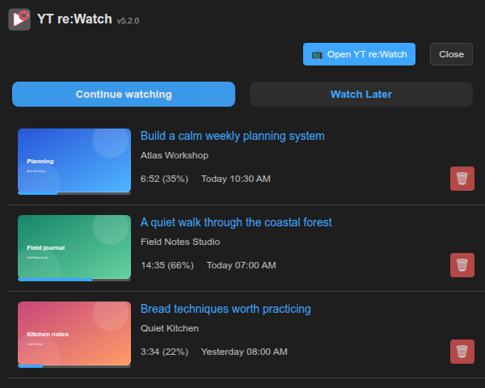
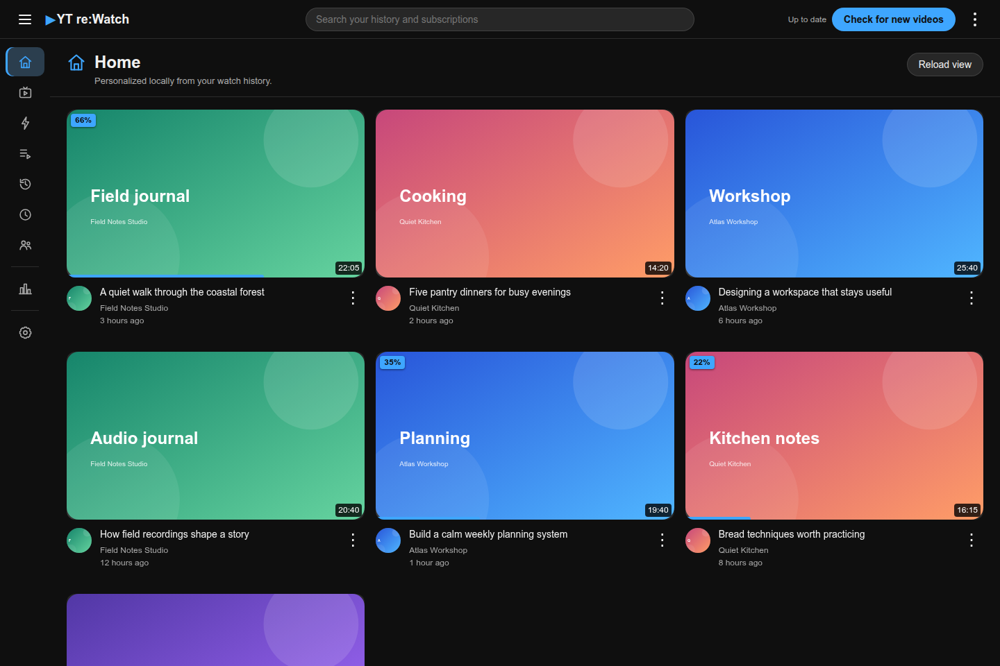
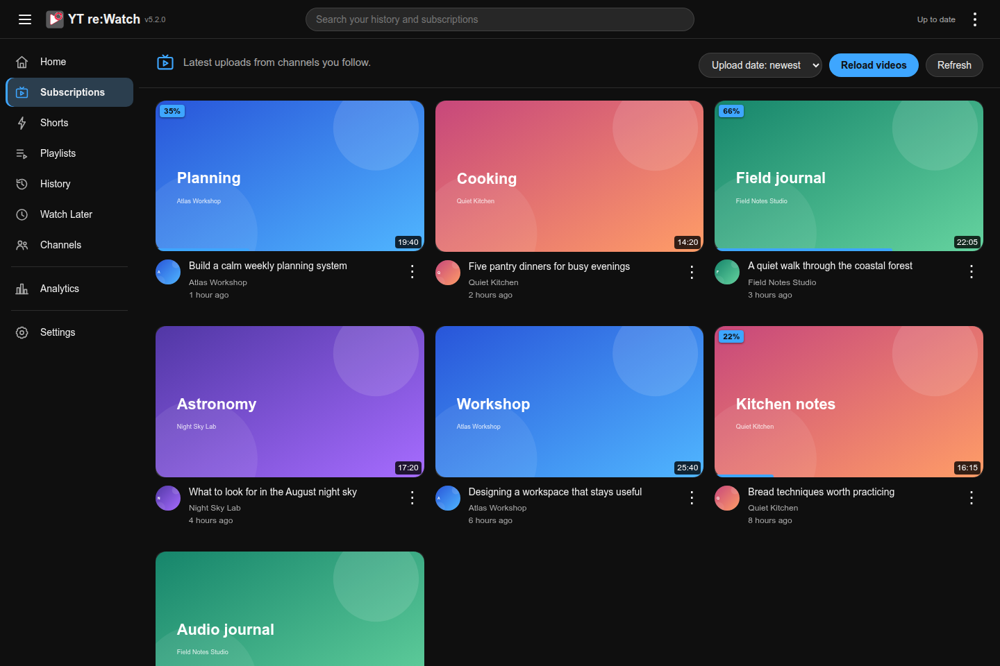
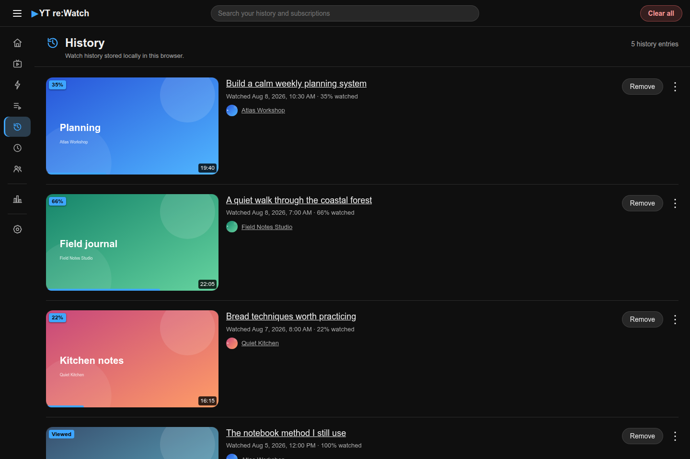
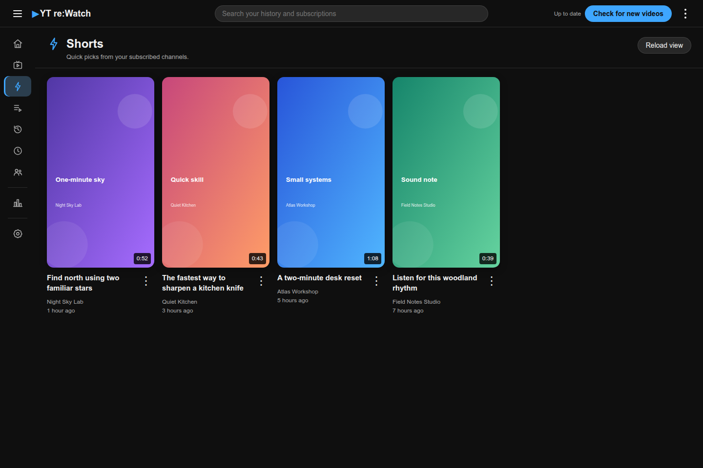
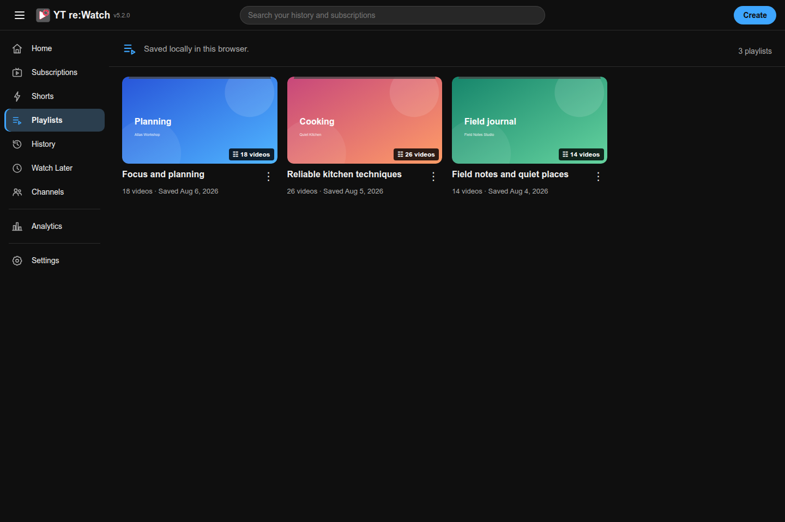
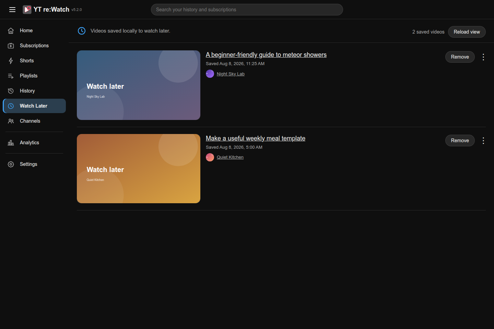
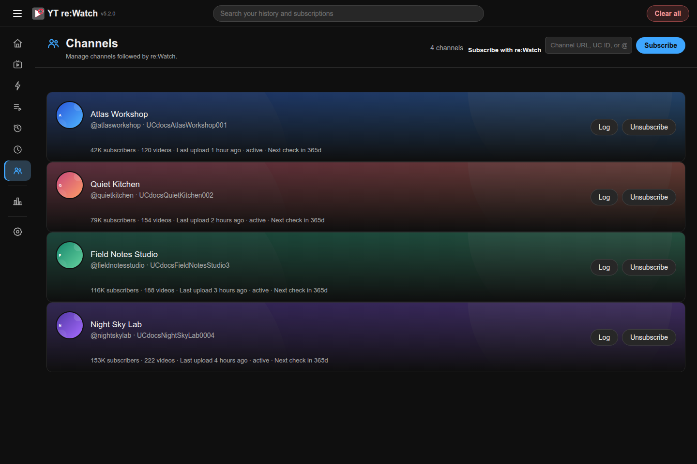
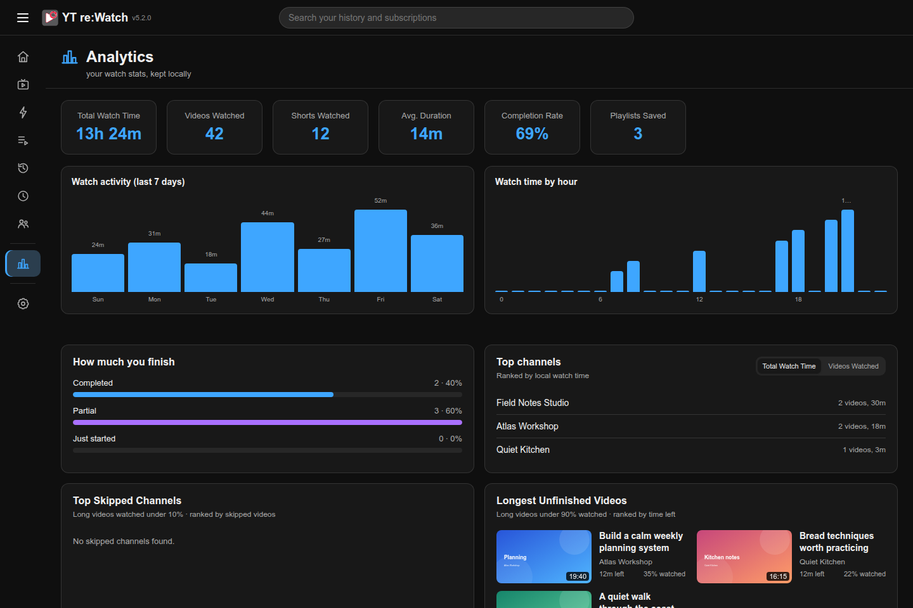
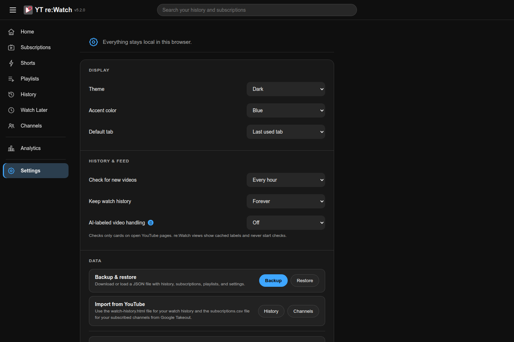

# YT re:Watch detailed guide

YT re:Watch records YouTube history and progress in the current browser profile. It works while logged out and remains independent when you switch YouTube accounts.

## Install and begin

### Chrome

1. Open the [Chrome Web Store listing](https://chromewebstore.google.com/detail/local-youtube-video-histo/pebiokefjgdbfnkolmblaaladkmpilba).
2. Select **Add to Chrome**, then confirm.
3. Pin the re:Watch button if you want quick access.

### Firefox

1. Open the [Firefox Add-ons listing](https://addons.mozilla.org/firefox/addon/yt-rewatch/).
2. Select **Add to Firefox**, then confirm the requested permissions.
3. Pin the re:Watch button if desired.

Visit YouTube and play a video normally. re:Watch begins saving after meaningful playback, then updates the position as you continue. The record is separate from YouTube's account history. On first use, a re:Watch welcome notice can open the same compact popup as the toolbar button.

## Interface overview

The toolbar popup is a compact resume surface. The full-page interface contains the complete v5 workflow.

| Tab | Purpose |
| --- | --- |
| Home | Locally arranged videos from followed channels |
| Subscriptions | Complete chronological cached subscription inventory |
| Shorts | Locally watched YouTube Shorts |
| Watch Later | Videos explicitly saved for later in this browser profile |
| Playlists | References that open the original YouTube playlist |
| History | Ordinary watched videos and progress |
| Channels | Local follows and, when present, ignored import records |
| Analytics | Locally calculated activity and channel insights |
| Settings | Feed, appearance, backup, import, and data controls |

### Popup { #popup }

*Resume unfinished videos or open the full re:Watch interface.*

The popup also reports subscription-import results. If an import skipped previously removed channels, its action opens **Channels → Ignored** so you can review them.

## Home and Subscriptions

### Home { #home }

*Home arranges cached uploads using local viewing and feedback signals.*

Home is not a copy of the YouTube recommendation service. It ranks locally cached uploads from channels followed in re:Watch. Opening Home regenerates that local view and does not start a Home-owned network request.

Home uses stable 50-card pages. Moving between pages does not duplicate cards or silently change the page boundary.

### Subscriptions { #subscriptions }

*Subscriptions lists cached uploads in the selected upload-date or detection-date order.*

Subscriptions is the complete inventory of regular cached uploads. Choose
upload-date or detection-date ordering; the selection remains active through
**Reload videos**, **Refresh**, and **Show**. The view also uses stable 50-card pages.

### Reload videos, Refresh, and Show

- **Reload videos** checks followed channels and updates the visible list, even when their normal check time is still in the future. It includes low-activity channels and preserves the selected ordering. Channels in failure backoff or already being scanned are deferred; the status reports checked, failed, and deferred counts.
- **Refresh** renders current local storage again without starting a feed request.
- **Show** reloads the complete Subscriptions inventory after a scan or subscription-import handoff and retains its selected ordering.

The interface renders cached data before initialization work completes, so an existing feed remains usable during a scan.

### Local search

Search matches locally saved history and cached feed records. It does not send the query to YouTube and cannot discover a video that the extension has never stored.

Feed and popup searches run after a 300 ms pause in typing. Press Enter to search immediately. Clearing the field takes effect immediately and cancels a pending search.

### Card actions

Video menus provide local actions such as more or less from a channel, hide, subscribe or unsubscribe, Watch Later, and playlist-reference actions where applicable. Following state is matched by canonical YouTube channel identity so the card does not offer **Subscribe** for a channel already followed locally.

## History and Shorts

### History { #history }

*History keeps ordinary viewing activity and resume progress local.*

History cards show the available channel, progress, and video duration. When metadata or progress changes, re:Watch updates the video-specific portion of the card while preserving its **Remove** control and three-dot menu.

Removing a history record also creates a temporary deletion marker so an older archive or import cannot immediately recreate it.

### Shorts { #shorts }

*Shorts separates locally watched short-form videos from ordinary history.*

re:Watch follows Shorts navigation inside YouTube's single-page interface and records the active Short's video and channel identity. The Shorts tab updates from local history without requiring a feed reload.

## Playlists { #playlists }

*A saved reference opens its original playlist on YouTube.*

v5 stores YouTube playlists as references with available title, artwork, and source link. It does not fetch the playlist's member videos in the background.

The per-playlist **Ignore videos** toggle prevents history saves while viewing that playlist. The global **Pause history in playlists** setting applies the same behavior to every playlist.

You can also create and manage extension-owned local playlists in this view. They are separate from YouTube playlist references and never change a YouTube-account playlist.

## Watch Later { #watch-later }

*Watch Later keeps explicitly saved videos in a local, newest-first list.*

Watch Later is a small local list, separate from YouTube's account-based Watch Later playlist. Save a recognized video or Short by right-clicking it on YouTube and choosing **Save to Watch Later (local)**, or choose **Save to Watch Later** from a re:Watch card menu.

The **Watch Later** sidebar view orders saved videos newest first. Each row opens the original YouTube video and has a **Remove** action. re:Watch stores the video ID, link, title, and channel locally; if a page did not expose title or channel data when it was saved, the list repairs that metadata when it is next opened.

## Channels { #channels }

*Sort local follows and check each channel's uploads, activity, and scan history.*

Follow a channel from a supported YouTube channel/watch surface, a re:Watch video menu, or the Channels controls. You can also import subscriptions in Settings. re:Watch canonicalizes channel IDs and avoids duplicate follows.

### Sort followed channels

Use **Sort channels** and the direction button above the list. The default is **Name A–Z**, and the selected field and direction survive navigation and page reloads.

| Sort | Initial direction | Meaning |
| --- | --- | --- |
| Name | A–Z | Channel name, with natural number ordering |
| Date followed | Newest first | When the channel was added to re:Watch |
| Latest upload | Newest first | Most recent upload observed by re:Watch |
| Activity | Most active first | Observed publishing frequency; ties use latest upload first |
| Last checked | Oldest first | Most recent check attempt, including failed attempts; never-checked channels come first |

Missing upload dates and unknown activity are placed last in either direction. These controls apply to followed channels; the Ignored tab keeps its own list.

### Check one channel and inspect its log

Select **Check for new videos** on a channel card. The button shows that the check is running, then the card reports the result. A successful check refreshes its latest upload, recalculates activity, and sets the next check time. Newly discovered uploads are available through **Show**.

The action checks only that channel and bypasses its normal successful-check interval. Failure backoff and an existing scan can still defer it. Use **Reload videos** in the feed to check all followed channels.

**Log** loads the latest stored RSS attempts whenever it opens, including timestamps, HTTP status or failure code, and available details. An empty log means no RSS attempts have been recorded yet; it does not confirm a successful check.

### Activity and next-check timing

Activity is based on observed uploads, rather than the channel's lifetime video count. A busy recent upload pattern can raise its activity level immediately. Frequent uploads spread throughout a day are recognized even when the RSS sample covers less than a day; a short bulk-upload burst alone does not establish that cadence. Lower activity requires a quiet period and changes gradually.

Version 5.2.1 also removes obsolete 30-day delays left by older RSS 404 handling when the scheduler starts. It preserves independent failure backoff and running checks. If a frequently publishing channel still looks stale, use **Check for new videos** and review **Log**.

### Ignored channels

Unfollowing an imported/local channel can create a tombstone. Future imports skip that channel instead of silently restoring it. When one or more tombstones exist, an **Ignored** internal tab appears under Channels.

For each ignored channel you can:

- **Restore** it to the local subscription list; or
- **Forget** the tombstone so a later import may add it again.

When no tombstones exist, the Ignored tab is hidden instead of showing an empty state.

## Analytics { #analytics }

*Analytics derives viewing patterns from local extension data.*

Analytics includes total watch time, videos and Shorts watched, average duration, completion rate, saved playlist references, weekly activity, and watch time by hour. Hourly bars share a consistent baseline so selected or low-activity hours remain visually comparable.

Additional insights include unfinished videos and skipped, watched, and completion groupings. Channel metrics can be switched and sorted without sending history to a server. A compact local statistics snapshot improves startup speed and can be rebuilt from the full local history.

## Settings { #settings }

*Settings contains appearance, import, backup, and data-management controls.*

### Appearance and overlays

- Choose System, Light, or Dark theme.
- Change the viewed-overlay text, color, and size.
- YouTube thumbnail overlays are best effort because YouTube can change its page structure.

### AI-labeled video handling

Under **History & feed**, choose **Off**, **Badge**, **Dim**, or **Hide** for
videos that YouTube itself discloses as **Made with AI**. The feature is off by
default and experimental. It is not a general AI detector: an unmarked video
is not confirmed non-AI.

When enabled, re:Watch checks previously unchecked cards only on open,
supported YouTube pages as they approach the viewport and caches the result
locally. **Badge** adds an AI marker, **Dim** also de-emphasizes the card, and
**Hide** removes disclosed cards from those YouTube lists. re:Watch’s own views
never start AI checks or send their local video IDs to YouTube; they display
cached AI results only, and **Hide** dims rather than removes a local card. See
[AI-labeled video handling](ai-labeled-videos.md) for supported surfaces,
limits, and privacy details.

That separation protects the local library: browsing, paging through, or
scrolling a re:Watch view does not reveal its History, subscription, or saved
video IDs to YouTube.

### Retention

Choose an automatic cleanup period from 1–180 days, or **Forever**. Popup/history pagination preferences affect their respective lists; Home and Subscriptions always use stable 50-card pages.

### Subscription import

Import accepts supported subscription files and reports added, existing, invalid, and ignored outcomes. The import result remains visible in Settings and can hand off to the chronological inventory or ignored-channel review.

### Backup and restore

**Backup** downloads a JSON file containing supported history, playlist references, Watch Later records, legacy and canonical subscriptions, ignored-channel tombstones, settings, preferences, and analytics data. Rebuildable feed inventory and transient scheduler state need not be preserved.

**Restore** merges compatible data into the current profile. Canonical subscriptions are matched by YouTube channel ID; restoring the same backup repeatedly does not create duplicates. Keep backup files private because they can reveal viewing habits.

### Reset all data

Reset removes all re:Watch-owned data in the current browser profile: history, playlist references, Watch Later, canonical subscriptions, tombstones, feed and scheduler state, deletion markers, analytics, settings, and legacy compatibility records. Export first if you may need the data again.

## Account and privacy behavior

- re:Watch storage belongs to the browser profile, not the active YouTube account.
- Switching Google accounts does not create a separate re:Watch history.
- There is no re:Watch login, OAuth connection, cloud synchronization, or remote search in v5.
- Public RSS/channel metadata requests omit browser credentials.
- YouTube and other parties can still observe normal browsing and network activity.

See [Privacy and data](privacy.md) for the complete boundary.

## Moving data between browsers or devices

1. Open Settings in the source browser and select **Backup**.
2. Transfer the JSON file securely.
3. Open Settings in the destination browser and select **Restore**.
4. Select the backup and allow the merge to complete.

There is no automatic cross-device sync.

## Help

If a feature is not behaving as described, use the [Troubleshooting guide](troubleshooting.md). For short answers, see the [FAQ](faq.md). Include the browser/version, operating system, reproduction steps, and visible status or error text when reporting a [GitHub issue](https://github.com/EdinUser/YouTubeLocalHistory/issues).
