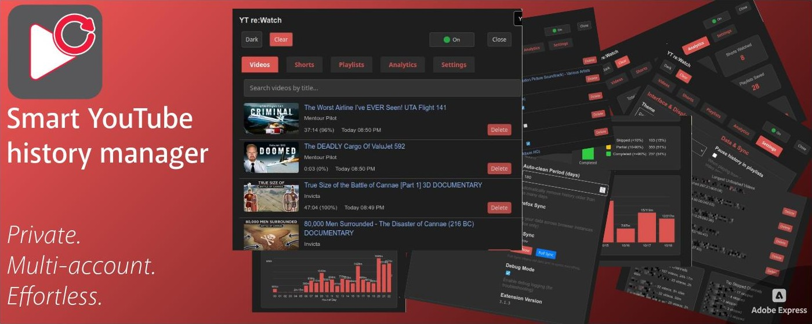
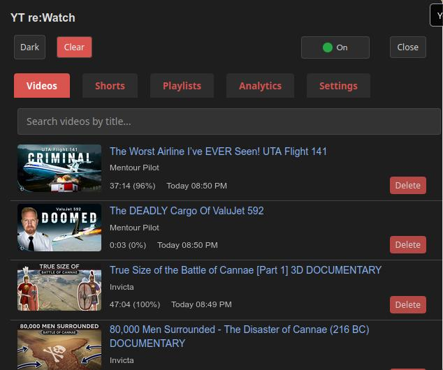
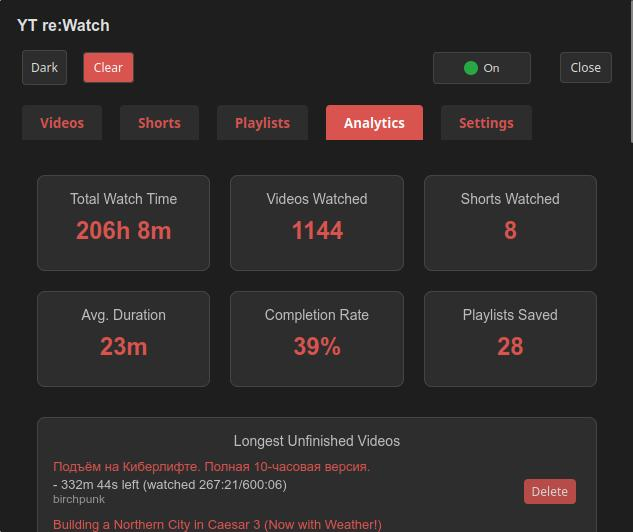
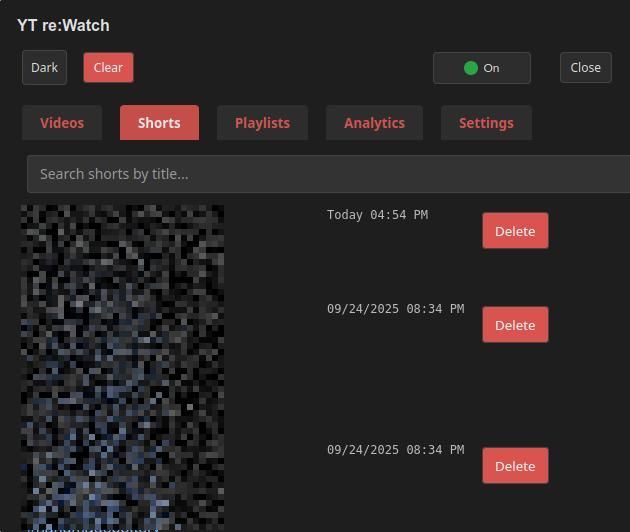
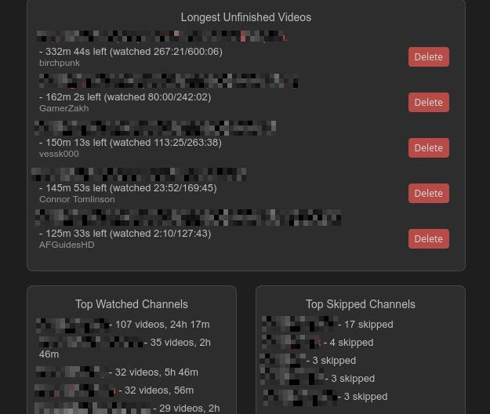
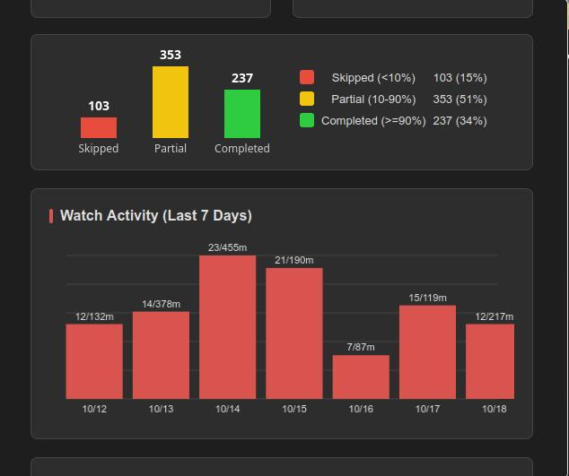
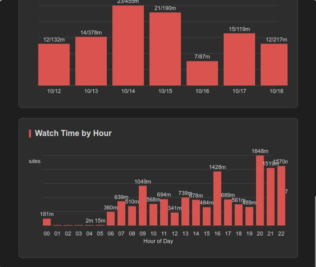
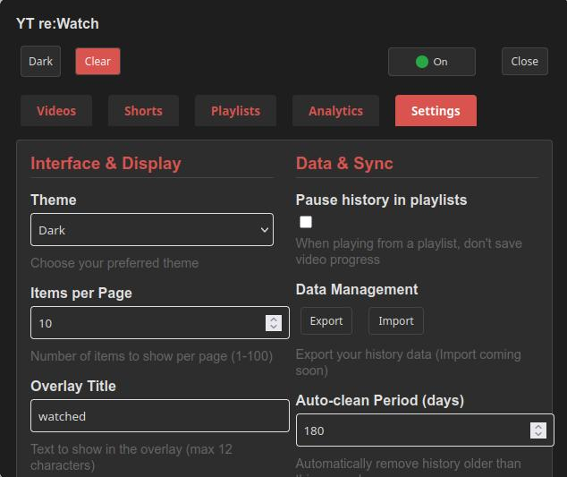
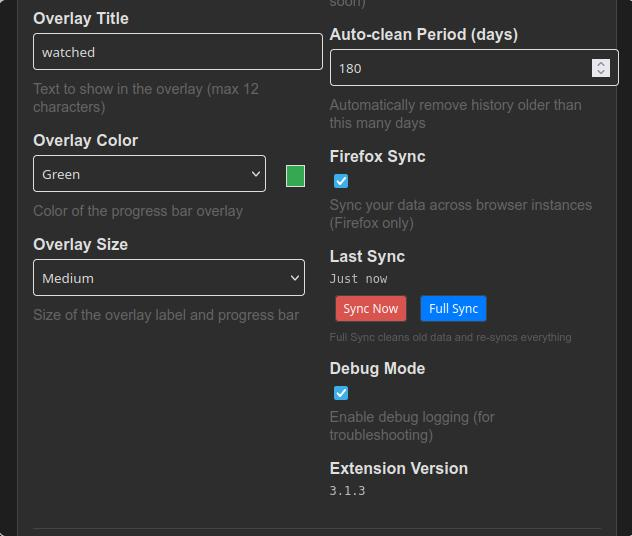

# 🎬 YT re:Watch — YouTube History Extension for Multi-Account Privacy

A private YouTube history extension that keeps multi-account progress in sync while staying privacy-first and local-only.

*Keep track of your YouTube journey — your data stays private on your device*

YT re:Watch is a privacy-first YouTube history extension that works across multiple accounts (or no account), tracks your progress locally, and keeps your watch history independent from Google so you can resume anywhere without losing data.

# ❤️ Support the Project

If you find YT re:Watch helpful, you can support ongoing development on [Patreon](https://patreon.com/EdinUser)!

### 🌐 Visit Our Website
[https://rewatch.kirilov.dev/](https://rewatch.kirilov.dev/) - Complete documentation, guides, and latest updates

---

## 🤔 What is YT re:Watch?

**Ever lost your YouTube progress when switching accounts? Or wanted to track videos without logging in?**

YT re:Watch solves both problems with **Account Independence + YouTube History Privacy**:

### 🔄 **Account Independence** 
- ✅ **Same history across ALL YouTube accounts** - switch freely without losing progress!
- ✅ **Works WITHOUT any account** - no login required, ever
- ✅ **Family-friendly** - share computers without mixing viewing histories
- ✅ **Multi-account workflow** - perfect for work/personal account users

### 🔒 **YouTube History Privacy**
- ✅ **Replaces YouTube's built-in history** - completely independent from Google
- ✅ **Local storage only** - Google doesn't get your viewing progress data
- ✅ **No history profiling** - your viewing progress stays yours
- ✅ **Unlimited local storage** - GB-scale capacity with hybrid IndexedDB system

*Your videos, your progress, your way - regardless of which account you use*

## 🚀 Get Started in 30 Seconds

### Step 1: Install the Extension
**Chrome Users:** [Get it from Chrome Web Store →](https://chromewebstore.google.com/detail/local-youtube-video-histo/pebiokefjgdbfnkolmblaaladkmpilba)

**Firefox Users:** [Get it from Firefox Add-ons →](https://addons.mozilla.org/firefox/addon/yt-rewatch/)

### Step 2: That's It!
- Go to YouTube and start watching videos
- The extension works automatically in the background
- Click the extension icon to see your watch history

Need a deeper walkthrough? Read the [Detailed Guide](./detailed_guide.md). Quick answers live in the [FAQ](./faq.md), fixes are in [Troubleshooting](./troubleshooting.md), and release notes are in the [Changelog](../CHANGELOG.md).

## 🎯 Who is This For?

### 🔄 **Multi-Account Users** (Our #1 use case!)
- "I have separate work and personal YouTube accounts - hate losing progress when switching"
- "My family shares this computer - we need separate viewing histories"
- "I manage multiple YouTube channels and need consistent progress tracking"
- "I don't want to stay logged in but still want to track what I've watched"

*See your progress on any account - or no account at all*

### 🔒 **Privacy-Conscious Users**
- "I want to use YouTube without Google tracking my viewing habits"
- "I need a private alternative to YouTube's built-in history"
- "I want to explore content without affecting my recommendations"
- "I want to research sensitive topics without creating a profile"

### 👨‍🎓 **Students & Researchers**
- "I watch educational content across different accounts/devices"
- "I want to track my video watching without Google profiling"
- "I need consistent history for research projects"

*View your video watching statistics across all accounts*

### 🙋‍♀️ **Anyone Who Wants Convenience**
- "I watch long videos but often get interrupted"
- "I want to remember which videos I've already seen"
- "I'm tired of YouTube losing my progress"

## 📱 What You'll See

### 🏷️ **Visual Overlays on YouTube**
The extension adds helpful visual indicators directly on YouTube:

*Smart overlays show your progress across all accounts*

- **"Viewed" labels** - See which videos you've already watched
- **Progress bars** - Visual indicator of how much you've completed
- **Works everywhere** - Video listings, search results, recommendations
- **Fully customizable** - Change colors, text, and size in Settings

**Overlay Customization Options:**
- **Text**: Change "viewed" to any word you prefer (max 12 characters)
- **Colors**: Choose from blue, red, green, purple, or orange
- **Size**: Small, medium, large, or extra large labels
- **Learn more**: [Complete customization guide](./detailed_guide.md#overlay-customization)

### 🎛️ **Extension Interface**
**Videos Tab** - Your main viewing history:

  
Your history list shows the channel name under each video title to help you scan quickly.

**Shorts Tab** - Separate tracking for YouTube Shorts:

**Analytics Tab** - See your viewing patterns:

*Summary cards and top channels in the Analytics tab*

*Completion bar chart, unfinished videos, and skipped channels*

*Watch activity by day and by hour in the Analytics tab*

*Additional analytics showing watch time patterns and channel statistics*
  
These charts now prefer a locally persisted, privacy‑preserving stats snapshot (rebuilt from your full hybrid history) for better accuracy and responsiveness. Keys are local‑day `YYYY-MM-DD` and 24 hourly buckets, and the activity view focuses on the last 7 local days only.

- **Longest Unfinished Videos**: Resume long videos you haven't finished (shows channel, time left, and link)
- **Top Watched Channels**: Your top 5 channels by videos watched (with links)
- **Top Skipped Channels**: Your top 5 channels where you most often skip long videos (with links)
- **Completion Bar Chart**: See your completion rate for long videos (skipped, partial, completed) with a bar chart and legend

**Settings Tab** - Customize everything:

*Additional settings for data management, privacy, and advanced features*

## 🔐 Account Independence + History Privacy = Perfect Combination

### 🔄 **Why Account Independence Matters**
Traditional YouTube history is **tied to your account** - meaning:
- ❌ Switch accounts → lose your progress
- ❌ Log out → can't access your history (it stays with the account)
- ❌ Share computer → mix everyone's histories
- ❌ Use incognito → no tracking at all

**YT re:Watch fixes ALL of this** by storing data locally on your device, not tied to any account!

### 🔒 **History Privacy Bonus: Google Doesn't Get Your Progress**
Because we store everything locally:
- ✅ **No Google servers** involved in your history tracking
- ✅ **No profiling** based on your viewing progress
- ✅ **No influence** on recommendations from your progress data
- ✅ **No progress data collection** - we literally cannot see what you watch

### 🏠 **Your Data, Your Rules**
- **Local storage only** - stays on your device
- **Export anytime** - your data, your backup
- **No cloud dependency** - works offline
- **Account-agnostic** - same experience regardless of login status

### ⚠️ **Important Privacy Disclaimer**
**What this extension protects:** Your YouTube viewing history and progress tracking  
**What it DOESN'T protect:** This extension only handles YouTube history data. Google/YouTube still tracks you through:
- IP address tracking
- Browser fingerprinting  
- Cookies and other tracking mechanisms
- Analytics and advertising networks

**For complete privacy:** Use with VPN, privacy-focused browsers, ad blockers, and other privacy tools.

## 💡 Pro Tips

- **Dark Mode**: The extension automatically matches your system theme
- **Search History**: Use the search box to find specific videos
- **Export Data**: Back up your history from the Settings tab
- **Export/Import Data**: Manually transfer your history between devices via JSON files

## 🤝 Need Help?

### Quick Fixes
- **Extension not working?** Refresh the YouTube page
- **History not showing?** Close and reopen the extension popup
- **Missing videos?** Check if you're on youtube.com (not youtube.tv or mobile)

### Get Support
- 📖 **[Detailed Guide](./detailed_guide.md)** - Step-by-step instructions
- ❓ **[FAQ](./faq.md)** - Common questions and answers
- 💬 **[Community Forum](https://community.kirilov.dev/t/re-watch)** - Get help and connect with other users
- 💬 **[Telegram Chat](https://t.me/+eFftKWGVvSpiZjZk)** - Real-time community support
- 🐛 **[Report Issues](https://github.com/EdinUser/YouTubeLocalHistory/issues)** - Found a bug?

## 📈 What's New

- **v3.1.5**: Enhanced navigation detection, improved timestamp restoration for all YouTube navigation patterns, and intelligent save interval management
- **See all updates**: [CHANGELOG.md](../CHANGELOG.md)

## 🌟 Love YT re:Watch?

- ⭐ **Rate us** on the [Chrome Web Store](https://chromewebstore.google.com/detail/local-youtube-video-histo/pebiokefjgdbfnkolmblaaladkmpilba) or [Firefox Add-ons](https://addons.mozilla.org/firefox/addon/yt-rewatch/)
- 🗣️ **Tell your friends** - sharing is caring!
- 💝 **Contribute** - we welcome [pull requests](https://github.com/EdinUser/YouTubeLocalHistory/pulls)

---

## 📚 Complete Documentation

### 👥 For All Users
- **[FAQ](./faq.md)** - Frequently asked questions
- **[Detailed User Guide](./detailed_guide.md)** - Complete feature walkthrough
- **[Troubleshooting Guide](./troubleshooting.md)** - Solve common problems

### 🔧 For Developers
- **[Technical Documentation](./technical.md)** - Architecture and APIs
- **[Contributing Guide](./contributing.md)** - How to contribute
- **[Build Instructions](./build.md)** - Development setup

## ℹ️ About YT re:Watch
YT re:Watch is a privacy-first YouTube history extension that keeps watch progress consistent across multiple accounts, stores data locally instead of on Google, and helps you track and resume videos with customizable overlays and stats.

---

  Made with ❤️ for YouTube enthusiasts everywhere

## 🌐 Multilanguage Support

YT re:Watch is available in multiple languages. All non-English translations are currently machine-generated. If you're a native speaker, your help is welcome—see the technical docs for how to contribute! 